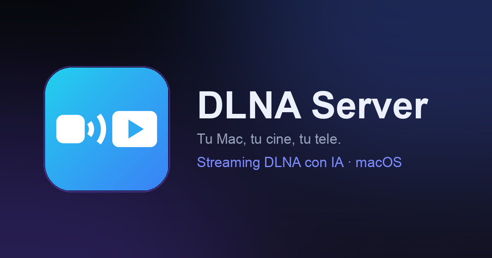

  

<h1 align="center">DLNA Server for macOS</h1>

  Turn your Mac into a full DLNA/UPnP media server. 
  Stream your movie library to any TV, console or media player on your network —
  with AI-powered metadata, posters and live TV.

  
  
  
  

> **This repository publishes official binary releases only** — DLNA Server is
> closed-source commercial software. Questions and support:
> [support@it-systems.es](mailto:support@it-systems.es).

## Download

| | |
|---|---|
| :inbox_tray: **Full version** | [Download the latest DMG](https://github.com/mavksoft/dlnaserver-releases/releases/latest) — free trial, lifetime license €19.90 |
| :globe_with_meridians: **Website** | [www.dlnaserver.com](https://www.dlnaserver.com) |
| :iphone: **Lite** | A sandboxed Lite edition is on its way to the Mac App Store |

## Features

- **DLNA/UPnP server** — SSDP discovery, ContentDirectory browsing, HTTP range
  streaming. Works with Samsung/LG/Sony TVs, VLC, Kodi, game consoles…
- **AI-powered library** — automatic filename cleanup, movie identification,
  posters, ratings, trailers and metadata in your language
  (ES/EN/FR/IT/DE/PT + remotely managed languages).
- **Live TV & IPTV** — M3U lists and Xtream/Stalker portals, EPG, channel
  logos and recording — fully independent from your DLNA library.
- **Built-in downloads** — torrent engine (TorrServer) and a native
  eD2k/eMule client.
- **Subtitles & artwork** — external `.srt`, embedded tracks and DLNA
  artwork endpoints for every renderer.
- **Menu-bar app** — lives in the tray; keeps serving with the window closed.
- **Local web player** — watch from any browser, with resume position.
- **Privacy-first** — your library never leaves your Mac; optional,
  anonymous usage stats only.

## Requirements

macOS 13 (Ventura) or later · Apple Silicon & Intel (universal binary) ·
Signed & notarized by Apple.

## What's in this repo

Each [release](https://github.com/mavksoft/dlnaserver-releases/releases)
contains:

- `DLNA-Server-<version>.dmg` — signed + notarized drag-to-Applications installer
- `DLNA-Server-<version>.zip` — Sparkle update archive (EdDSA-signed), used by
  the in-app auto-updater

## Support

- Support form: [www.dlnaserver.com](https://www.dlnaserver.com#support)
- Email: [support@it-systems.es](mailto:support@it-systems.es)

---

## Español

Servidor DLNA/UPnP para macOS: convierte tu Mac en un servidor multimedia y
envía tus películas a cualquier tele o reproductor de la red — con metadatos y
carátulas por IA, TV en directo (IPTV), descargas torrent/eMule, subtítulos y
reproductor web.

- **[Descargar DMG](https://github.com/mavksoft/dlnaserver-releases/releases/latest)** —
  prueba gratuita, licencia completa 19,90 €
- Web: [www.dlnaserver.com](https://www.dlnaserver.com)
- Soporte: [support@it-systems.es](mailto:support@it-systems.es)

